<div align="center">

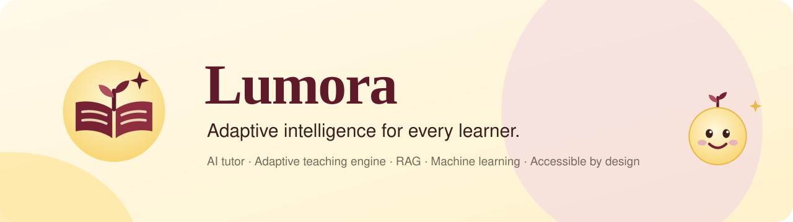

<br />


# Lumora

**An adaptive learning platform that changes *how* it teaches based on how each child learns,
with an AI tutor, personalised quizzes and accessibility built in.**

[](https://github.com/Divyanshi12coder/lumora/actions/workflows/ci.yml)


<br />


<!-- After deploying (docs/DEPLOYMENT.md), point the Live demo button at your Vercel URL. -->
[**🌐 Live demo (deploy to enable)**](docs/DEPLOYMENT.md) &nbsp;·&nbsp;
[**📘 API docs**](docs/API.md) &nbsp;·&nbsp;
[**💻 GitHub**](https://github.com/Divyanshi12coder/lumora) &nbsp;·&nbsp;
[**🧠 Model card**](docs/MODEL_CARD.md)

</div>

> **Lumora supports learning preferences and accessibility needs, including those of learners with ADHD or dyslexia.
> It is not a medical tool: it does not diagnose, screen for or treat any condition, and its AI tutor refuses to try.**

---

## Overview

Lumora is a full-stack AI education platform for young learners. Every answer, hint, skip, re-read and "explain it
differently" is a small signal. Lumora turns those signals into a **teaching strategy**: difficulty, explanation style,
amount of text, hint depth, number of examples, pacing, visual support and quiz length. Every lesson, quiz and tutor
reply then follows that strategy.

The child sees a warm, simple experience: *"You're getting really good at this! Ready for a little more challenge?"*
Parents and teachers get a separate **Insights** view with mastery curves, engine decisions and model transparency. Engineers
get an inspectable codebase: a domain-driven FastAPI backend, PostgreSQL + pgvector RAG, interpretable ML, structured LLM
outputs, child-safety guardrails, and tests on both SQLite and real PostgreSQL.

|  | What's real here |
|---|---|
| 🧭 **Adaptive engine** | A pure, unit-tested backend domain service with documented weights, explainable factors and an audit log |
| 💬 **AI tutor "Divi"** | Intent detection → strategy → RAG retrieval → structured prompt → schema-validated output → safety screen |
| 📚 **RAG** | Chunking → 384-dim embeddings → `vector(384)` + HNSW index in PostgreSQL → hybrid re-ranking → cited sources |
| 📈 **ML** | Bayesian Knowledge Tracing, logistic-regression struggle model, validated engagement model, K-means profiles |
| 🔐 **Full stack** | JWT auth with revocable tokens, bcrypt, 22 tables via Alembic, rate limiting, secure headers, file validation |
| 🧪 **Verified** | 89 backend tests (run on SQLite **and** PostgreSQL 16 + pgvector), 16 frontend tests, browser E2E pass |

## Why this exists

Most learning tools teach every child the same way: the same pace, the same wall of text, the same hint repeated louder.
Children who process information differently, such as many learners with ADHD or dyslexia, or simply children who prefer
pictures to paragraphs, pay the highest price for that. Lumora's bet is that **adapting the presentation** (shorter steps,
fewer answer choices, read-aloud, worked examples, brain breaks, or a bigger challenge) is something software can do well,
transparently and safely. And it doesn't need to label a child to do it.

## Key features

<table>
<tr>
<td width="50%" valign="top">

**For learners**
- 🌞 Child-friendly dashboard: *What should I learn today? How am I doing? What did I achieve?*
- 🧩 Personalised quizzes: difficulty, length, 3 or 4 answer choices, review questions, hints, confidence check
- 💬 **Divi**, a friendly AI guide: explain · easier example · hint · quiz me · "I don't understand" · explain differently
- 📖 Adaptive lessons: the engine decides which sections open by default
- 🏅 Gentle progress: rings, a learning journey and badges. **No streak pressure**
- ♿ Text size, line spacing, readable font, read-aloud, focus mode, reduced motion, extra contrast

</td>
<td width="50%" valign="top">

**For grown-ups and engineers**
- 📊 Insights: mastery over time, accuracy, engagement, per-topic signals
- 🧠 Engine transparency: current strategy, factor contributions, decision history
- 🔬 Model card: provenance (synthetic vs real), held-out metrics, predictions
- 🗂️ Library: upload `.txt` / `.md` / `.pdf`, then index, inspect chunks and run retrieval yourself
- 🗓️ Study plan generated from the recommendation ranking
- 🛡️ Safety log counts (never message contents) and one-click account deletion

</td>
</tr>
</table>

## Adaptive learning engine

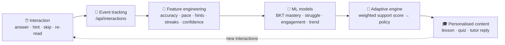
```mermaid
flowchart LR
  A["🖱️ Interaction<br/>answer · hint · skip · re-read"] --> B["📡 Event tracking<br/>/api/interactions"]
  B --> C["🧮 Feature engineering<br/>accuracy · pace · hints · streaks · confidence"]
  C --> D["🤖 ML models<br/>BKT mastery · struggle · engagement · trend"]
  D --> E["🧭 Adaptive engine<br/>weighted support score → policy"]
  E --> F["🎓 Personalised content<br/>lesson · quiz · tutor reply"]
  F -. new interactions .-> A
```

The engine (`backend/app/adaptive/engine.py`) is a pure function with no I/O. It is tested on its own and reused by the
landing-page demos, so the slider on the homepage runs the same code that teaches signed-in learners.

| Signal family | Weight | Need for support is high when… |
|---|---|---|
| Performance | 0.30 | recent (65 %) and overall (35 %) accuracy are low |
| Mastery (BKT) | 0.25 | P(known) is low |
| ML struggle prediction | 0.20 | the model predicts the next question will be hard |
| Behaviour | 0.15 | many hints, mistake streaks, skips, slow answers, "not sure", answer changes |
| Momentum | 0.10 | the accuracy trend is dipping |

Missing families (for example, no ML prediction yet) are dropped and the remaining weights re-normalised. With little data,
the score shrinks toward a gently supportive prior. "Too hard" feedback in the tutor nudges support up. Example output:

```json
{
  "band": "guided", "difficulty": "easy", "explanation_style": "worked_example",
  "content_density": "low", "hint_level": "guided", "example_count": 3,
  "review_required": true, "pacing": "slow", "visual_support": "high",
  "option_count": 4, "question_count": 5, "suggest_break": false, "tone": "warm",
  "support_score": 0.61, "data_confidence": 0.83,
  "rationale": ["Main factor - mastery: estimated mastery 24%.", "A short review is scheduled because some ideas need another look."],
  "factors": [{"family": "performance", "need": 0.52, "weight": 0.3, "note": "recent accuracy 40%, overall 55%"}]
}
```

Every strategy is persisted to `adaptive_strategies` together with its input signals, which gives a full audit trail.

## AI architecture

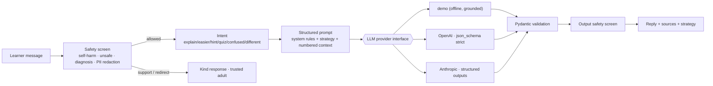
```mermaid
flowchart LR
  M["Learner message"] --> S1["Safety screen<br/>self-harm · unsafe · diagnosis · PII redaction"]
  S1 -->|allowed| I["Intent<br/>explain/easier/hint/quiz/confused/different"]
  I --> P["Structured prompt<br/>system rules + strategy + numbered context"]
  P --> L{{"LLM provider interface"}}
  L --> D1["demo (offline, grounded)"]
  L --> D2["OpenAI · json_schema strict"]
  L --> D3["Anthropic · structured outputs"]
  D1 & D2 & D3 --> V["Pydantic validation"]
  V --> S2["Output safety screen"] --> R["Reply + sources + strategy"]
  S1 -->|support / redirect| K["Kind response · trusted adult"]
```

- **Provider abstraction** (`AI_PROVIDER=demo|openai|anthropic`). All three implement one interface, and API keys come only from environment variables.
- **Structured outputs everywhere**: `TutorReply`, `GeneratedQuiz`, `DocumentSummary` and `StudyPlan` are Pydantic schemas, converted to strict JSON Schema for OpenAI and for Claude (`output_config.format`).
- **Never a crash for a child**: a provider error, timeout, refusal or invalid JSON falls back to the demo provider, and the UI says so.
- **Demo mode is honest**: it doesn't imitate an LLM. It builds answers from the retrieved passages and the structured lesson, shaped by the strategy, and every message is badged *Demo mode*.
- **Child safety**: the system prompt keeps Divi on learning, identifies it as an AI, and forbids diagnosis and requests for personal information. Rule-based input and output screens add a second layer. A wellbeing concern gets a caring "talk to a trusted adult" response, and personal details are removed before any LLM call.

## RAG pipeline

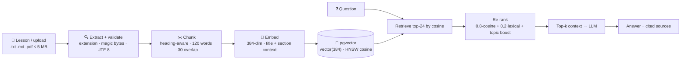
```mermaid
flowchart LR
  A["📄 Lesson / upload<br/>.txt .md .pdf ≤ 5 MB"] --> B["🔍 Extract + validate<br/>extension · magic bytes · UTF-8"]
  B --> C["✂️ Chunk<br/>heading-aware · 120 words · 30 overlap"]
  C --> D["🔢 Embed<br/>384-dim · title + section context"]
  D --> E[("🐘 pgvector<br/>vector(384) · HNSW cosine")]
  Q["❓ Question"] --> F["Retrieve top-24 by cosine"]
  E --> F --> G["Re-rank<br/>0.8·cosine + 0.2·lexical + topic boost"] --> H["Top-k context → LLM"] --> I["Answer + cited sources"]
```

- **Built-in library**: the 12 seeded lessons are ingested at startup as shared documents. Uploads are private to their owner.
- **Embeddings**: `local` uses deterministic feature hashing (unigrams, bigrams, character trigrams, signed, sublinear TF, L2) and runs fully offline, including in CI. `openai` uses `text-embedding-3-small` with `dimensions=384`, so the schema stays the same.
- **Verified on real PostgreSQL**: the HNSW index is used by the query planner (`Index Scan using ix_document_chunks_embedding_hnsw`).

## Machine learning

| Component | Model | Features | Role |
|---|---|---|---|
| Topic mastery | **Bayesian Knowledge Tracing** (guess = 1 / #options; hinted success counts as weaker evidence) | answer sequence | Engine, journey stage, results |
| Struggle prediction | **Logistic regression** (standardized, interpretable coefficients) | mastery, recent accuracy, hints, skips, streak, pace, confidence, difficulty, attempts | Engine family `ml_struggle` |
| Engagement | **Model selection on validation data** (gradient boosting vs logistic regression) | session minutes, events/min, accuracy, hints, skips, streak, idle | Break suggestions, page density, quiz length |
| Learner profiles | **K-means (k = 4)** with Hungarian-matched names | accuracy, hint rate, pace, skips, session length | Grown-up Insights only |
| Trend | Least-squares slope on a rolling accuracy | outcomes | Engine momentum, dashboard insight |
| Recommendations | Interpretable linear ranking | mastery gap, forgetting curve, prerequisite readiness, interest | "What can I try next?" |

**Honest results** (held-out learners, **synthetic** bootstrap data, from `metrics.json`):

| Model | ROC-AUC | Brier (baseline) | Notes |
|---|---|---|---|
| Struggle (logistic regression) | **0.690** | **0.209** (0.233) | Coefficients go in the expected directions |
| Engagement (selected: gradient boosting) | 0.573 | 0.242 (0.241) | **Weak**: no better than the base rate on Brier, so it's used only for gentle nudges |
| Profiles (K-means) | silhouette 0.168 | – | Behaviours form a continuum; the profiles are descriptive |

These numbers validate the pipeline, **not** real-world accuracy. See [`docs/MODEL_CARD.md`](docs/MODEL_CARD.md). Retrain on real
interactions with `python -m app.ml.train --source db`. The same feature code serves inference, real-data training and the simulator, so there is no train/serve skew.

## System architecture

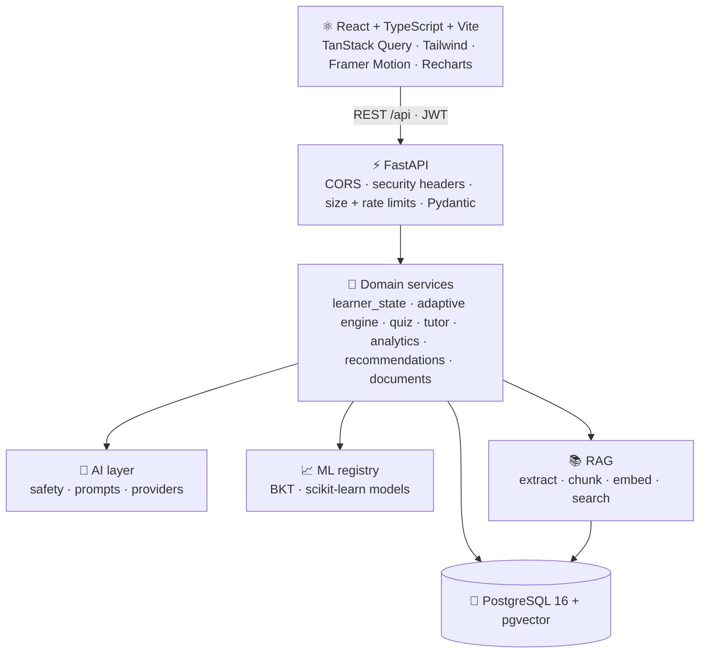
```mermaid
flowchart TB
  FE["⚛️ React + TypeScript + Vite<br/>TanStack Query · Tailwind · Framer Motion · Recharts"]
  FE -->|"REST /api · JWT"| API["⚡ FastAPI<br/>CORS · security headers · size + rate limits · Pydantic"]
  API --> SVC["🧩 Domain services<br/>learner_state · adaptive engine · quiz · tutor · analytics · recommendations · documents"]
  SVC --> AI["🤖 AI layer<br/>safety · prompts · providers"]
  SVC --> MLR["📈 ML registry<br/>BKT · scikit-learn models"]
  SVC --> RAG["📚 RAG<br/>extract · chunk · embed · search"]
  SVC --> DB[("🐘 PostgreSQL 16 + pgvector")]
  RAG --> DB
```

More diagrams (request sequence, engine maths, ER diagram) are in [`docs/ARCHITECTURE.md`](docs/ARCHITECTURE.md).

## Database architecture

22 tables managed with **SQLAlchemy 2** and **Alembic**: `users`, `student_profiles`, `learning_preferences`, `subjects`, `courses`,
`topics` (with prerequisites), `lessons` (structured JSON sections), `questions`, `documents`, `document_chunks` (`vector(384)`),
`learning_sessions`, `interaction_events`, `quiz_attempts`, `answers`, `mastery_scores`, `mastery_history`, `recommendations`,
`learning_goals`, `ai_conversations`, `ai_messages`, `adaptive_strategies` and `model_predictions`.

- Foreign keys with `ON DELETE CASCADE` for all user-owned data, which makes deletion real.
- Check constraints (difficulty 1–3, non-negative indices and response times) and unique constraints (one mastery row per user and topic, one answer per question per attempt).
- Composite indexes on hot paths: `(user_id, created_at)` for events, strategies and history, plus the HNSW vector index.
- CI runs `upgrade → downgrade → upgrade → alembic check`, so the migration and the models can't drift apart.

## User journey

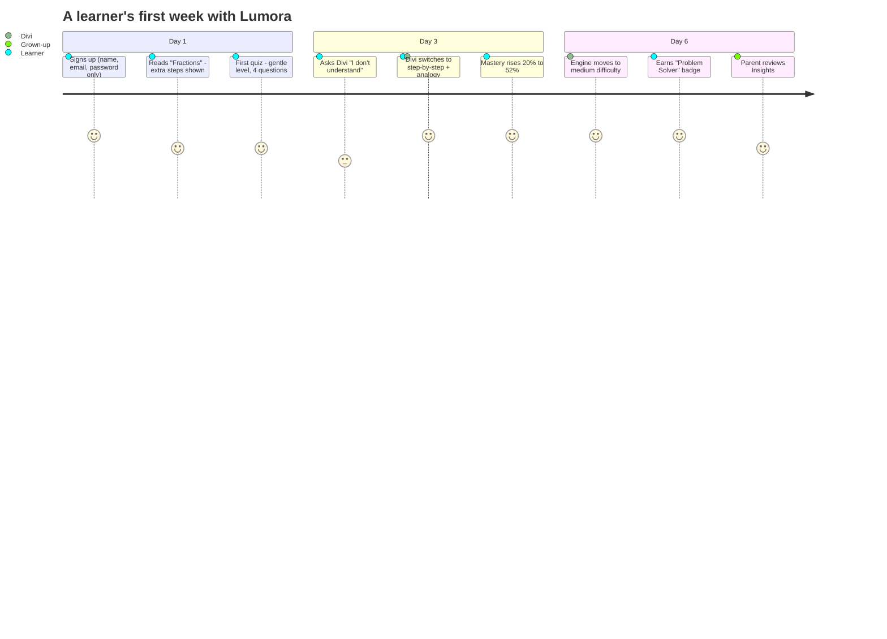
```mermaid
journey
  title A learner's first week with Lumora
  section Day 1
    Signs up (name, email, password only): 5: Learner
    Reads "Fractions" - extra steps shown: 4: Learner
    First quiz - gentle level, 4 questions: 4: Learner
  section Day 3
    Asks Divi "I don't understand": 3: Learner
    Divi switches to step-by-step + analogy: 5: Learner, Divi
    Mastery rises 20% to 52%: 5: Learner
  section Day 6
    Engine moves to medium difficulty: 5: Divi
    Earns "Problem Solver" badge: 5: Learner
    Parent reviews Insights: 4: Grown-up
```

## Screenshots

All screenshots are real captures of the running app (React dev server + FastAPI on PostgreSQL + pgvector), taken by an
automated browser run. The demo-account screens use the seeded learner, whose practice history is **simulated** and labelled as such in the UI.

| Landing: hero | Live engine slider |
|---|---|
| 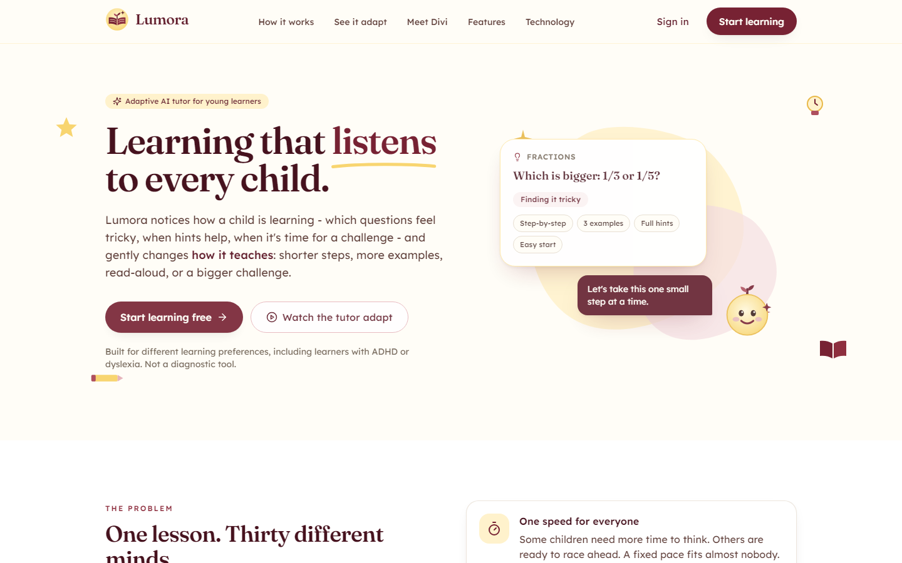 | 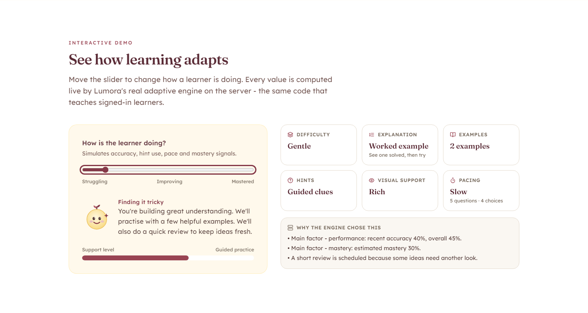 |
| **Watch the tutor adapt** | **Child dashboard** |
| 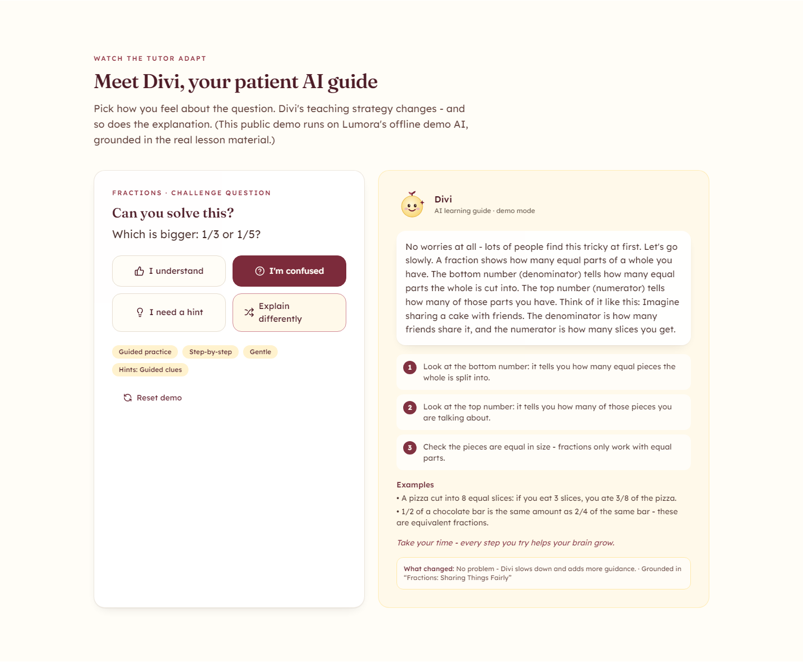 | 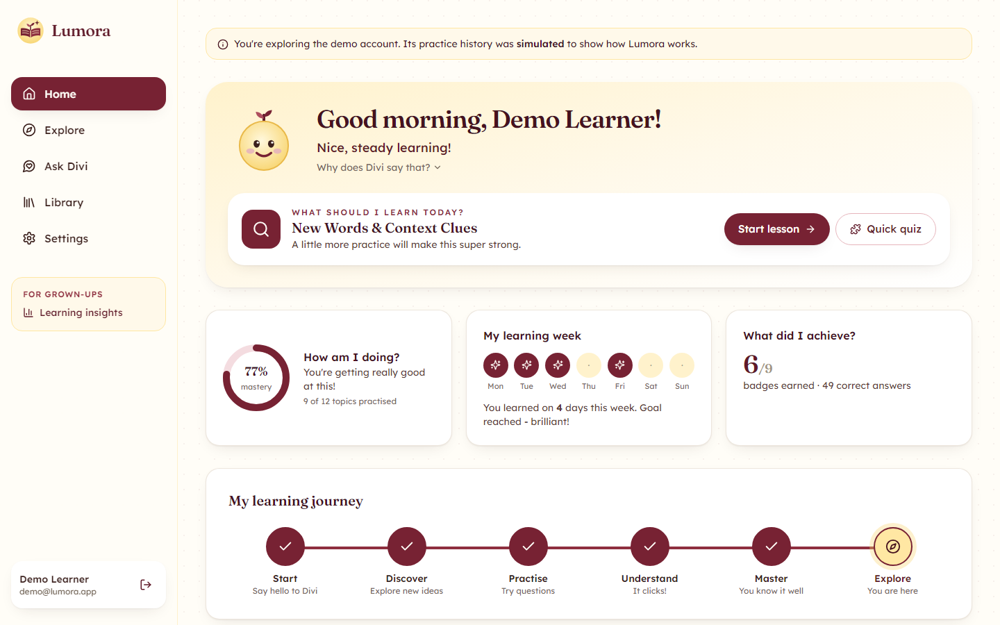 |
| **Adaptive lesson** | **Personalised quiz** |
| 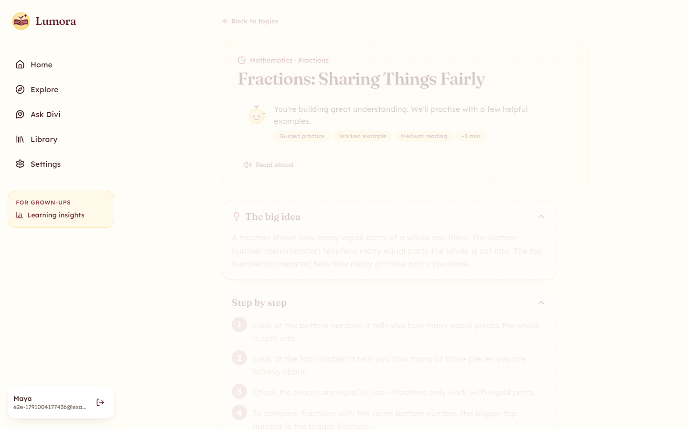 | 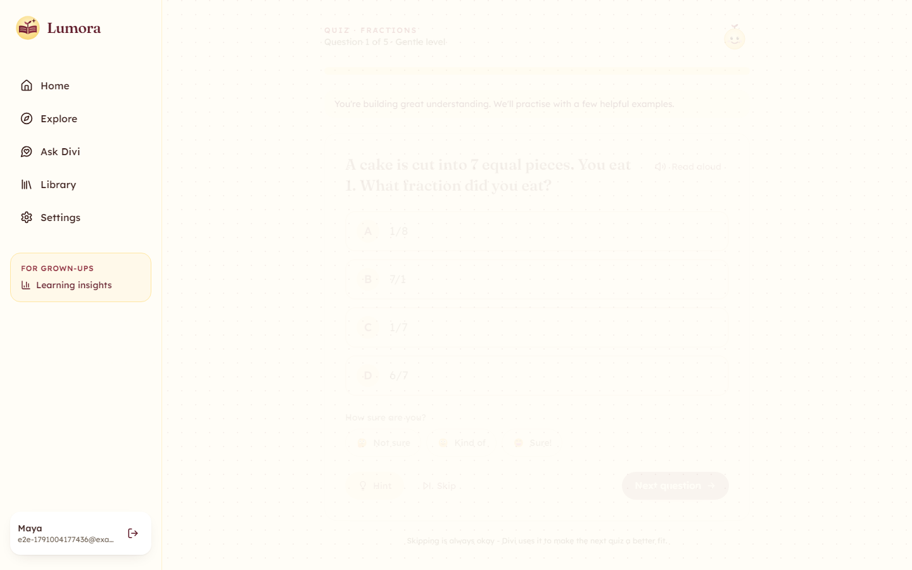 |
| **Quiz results + mastery** | **AI tutor with RAG sources** |
| 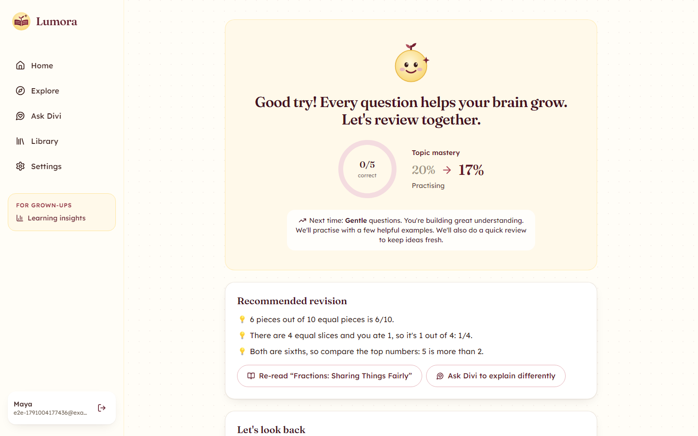 | 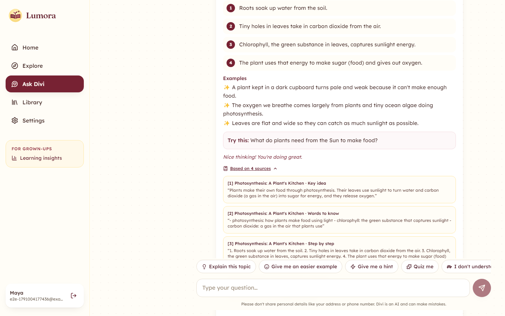 |
| **Explore subjects** | **RAG library search** |
| 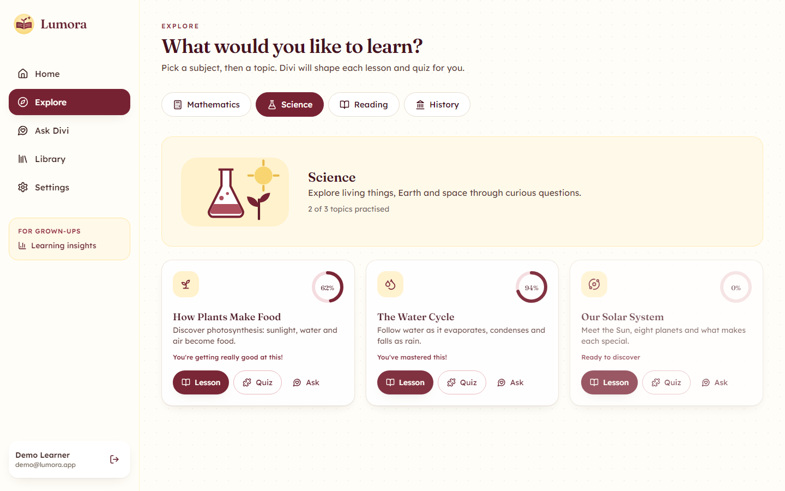 | 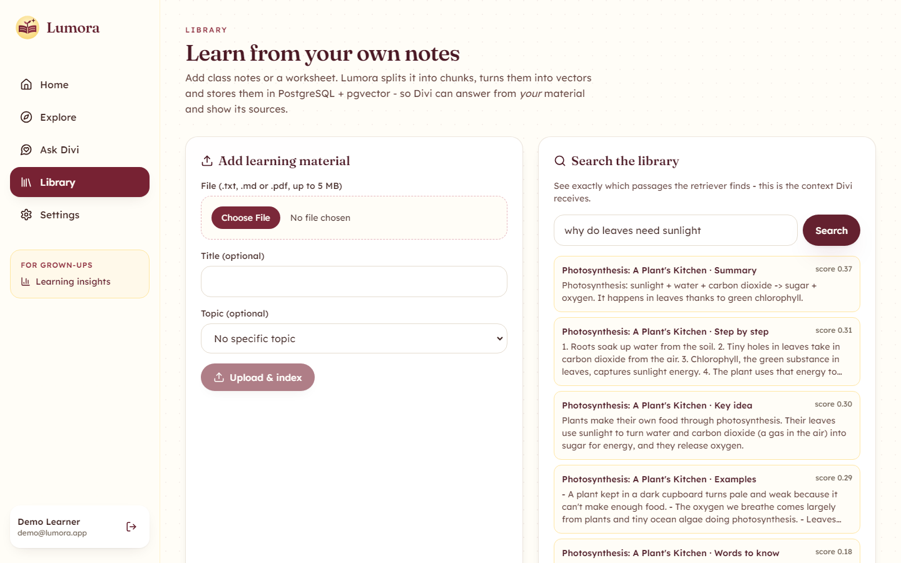 |

<details>
<summary><b>More: grown-up Insights, accessibility settings, tablet and phone</b></summary>

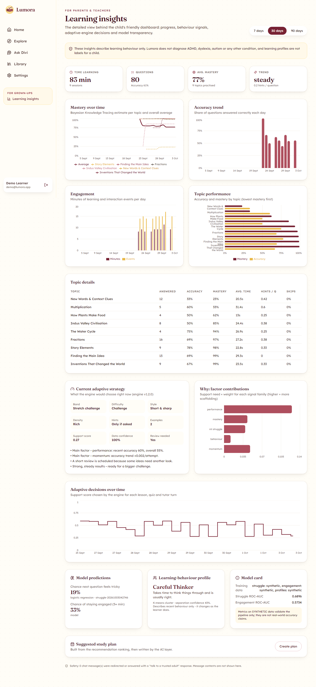
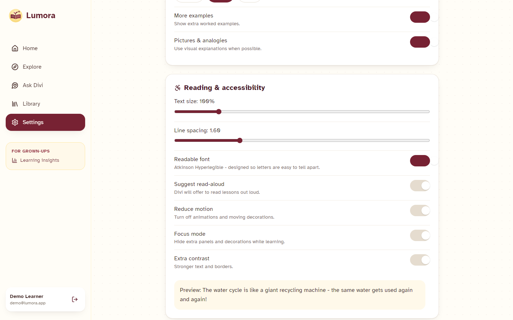

| Tablet | Phone |
|---|---|
| 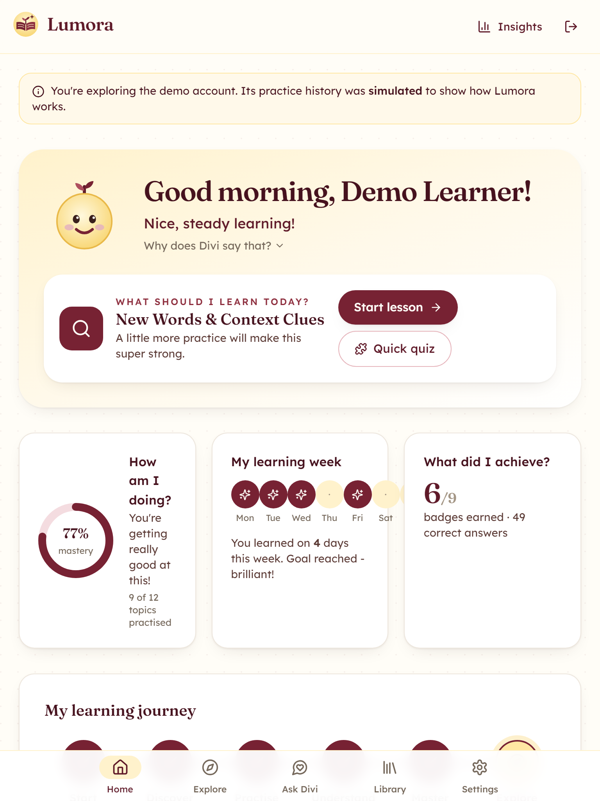 | 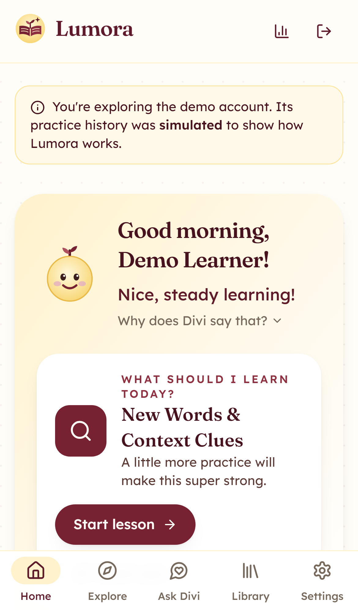 |

</details>

## Tech stack

| Layer | Technologies |
|---|---|
| Frontend | React 18, TypeScript (strict), Vite 6, Tailwind CSS, React Router, TanStack Query, Recharts, Framer Motion, Lucide |
| Backend | Python 3.12, FastAPI, Pydantic v2, SQLAlchemy 2, Alembic, PyJWT, bcrypt |
| Data | PostgreSQL 16, pgvector (HNSW), psycopg 3 |
| AI | Provider abstraction (demo / OpenAI / Anthropic SDKs), structured outputs, safety layer |
| ML | scikit-learn, pandas, NumPy, SciPy, joblib |
| Testing | Pytest (+ FastAPI TestClient), Vitest, Testing Library, Playwright (E2E run) |
| Infra | Docker, Docker Compose, nginx, GitHub Actions, Render blueprint, Vercel |

## API

Clean REST API with OpenAPI docs at **`/docs`** (Swagger) and **`/redoc`**. The full table is in [`docs/API.md`](docs/API.md). Highlights:

```
POST /api/auth/register · POST /api/auth/login · POST /api/auth/logout · GET /api/me
GET  /api/dashboard · GET/PUT /api/profile · GET /api/subjects · GET /api/courses · GET /api/topics
POST /api/lessons/{id}/start · POST /api/interactions · POST /api/sessions/start
POST /api/quiz/generate · POST /api/quiz/{id}/submit · GET /api/quiz/{id}/hint/{qid}
POST /api/tutor/chat · GET /api/tutor/history · POST /api/tutor/messages/{id}/feedback
GET  /api/analytics · GET /api/recommendations · POST /api/study-plan · GET /api/ml/model-card
POST /api/documents · POST /api/documents/{id}/ingest · GET /api/documents/search
POST /api/adaptive/preview · POST /api/demo/tutor · GET /api/health
```

## Local development

**Prerequisites:** Python 3.12+, Node 20+, and PostgreSQL 16 with pgvector. Or use Docker (below), or SQLite for a quick start.

```bash
git clone https://github.com/Divyanshi12coder/lumora.git && cd lumora
cp .env.example backend/.env           # edit DATABASE_URL / JWT_SECRET

# Backend
cd backend
python -m venv .venv && source .venv/bin/activate      # Windows: .venv\Scripts\activate
pip install -r requirements-dev.txt
alembic upgrade head                    # PostgreSQL (skip for SQLite: tables are created automatically)
python -m app.seed.run --demo-user      # curriculum + RAG library + demo learner
uvicorn app.main:app --reload           # http://127.0.0.1:8000/docs

# Frontend (new terminal)
cd frontend
npm install
npm run dev                             # http://localhost:5173 (proxies /api to :8000)
```

> **No PostgreSQL handy?** Set `DATABASE_URL=sqlite:///./lumora.db`. Everything works, and vector search falls back to an exact
> numpy cosine scan instead of pgvector.

Demo learner: `demo@lumora.app` / `LumoraDemo2026!` (or click **Explore the demo account** on the sign-in page).

## Environment variables

| Variable | Default | Description |
|---|---|---|
| `DATABASE_URL` | `sqlite:///./lumora.db` | PostgreSQL URL (`postgres://` is auto-normalised) or SQLite |
| `JWT_SECRET` | dev placeholder | **Required in production.** The app refuses to start with the default |
| `ENVIRONMENT` | `development` | `production` enables HSTS and the secret check |
| `CORS_ORIGINS` | `http://localhost:5173,…` | Comma-separated allowed origins |
| `AI_PROVIDER` | `demo` | `demo` · `openai` · `anthropic` |
| `AI_API_KEY` / `AI_MODEL` | – | Provider key / model override (defaults: `gpt-4.1-mini`, `claude-opus-5-5`) |
| `EMBEDDING_PROVIDER` | `local` | `local` (offline) · `openai` (+ `EMBEDDING_API_KEY`) |
| `SEED_DEMO_USER` | `true` in Docker | Create the demo learner with simulated history |
| `VITE_API_URL` (frontend) | empty | API origin for split deployments. Empty means same origin / dev proxy |

See [`.env.example`](.env.example). `.env` is git-ignored.

## Docker

```bash
cp .env.example .env        # set JWT_SECRET
docker compose up --build
```

| Service | URL |
|---|---|
| Web app (nginx + SPA, proxies `/api`) | http://localhost:8080 |
| API + Swagger | http://localhost:8000/docs |
| PostgreSQL + pgvector | `db:5432` (internal) |

The API container runs migrations, seeds data and serves on `$PORT`. The ML models are trained into the image at build time.

## Database setup

```bash
# PostgreSQL with pgvector (e.g. docker run -p 5432:5432 -e POSTGRES_PASSWORD=pw pgvector/pgvector:pg16)
cd backend
alembic upgrade head        # creates the vector extension, 22 tables, indexes and the HNSW index
python -m app.seed.run      # 4 subjects · 12 topics · 72 questions · 12 RAG documents
python -m app.ml.train      # optional: retrain (auto-selects real data when there is enough)
```

## Testing

```bash
cd backend  && pytest                                   # 89 tests, SQLite
TEST_DATABASE_URL=postgresql+psycopg://… pytest         # same suite on PostgreSQL + pgvector (after alembic upgrade)
ruff check app tests

cd frontend && npm test && npm run typecheck && npm run build   # 16 tests · strict TS · production build
```

The tests cover the adaptive engine (monotonicity, cold start, preferences, explainability), BKT and trend maths, model
training against baselines, chunking and extraction security, safety rules, auth (hashing, revocation, ownership), quiz
grading and adaptivity, RAG grounding, uploads, rate limiting, security headers and child-friendly error handling. CI also builds both
Docker images and smoke-tests `docker compose`.

## Deployment

Backend on **Render** (`render.yaml`: Docker web service + PostgreSQL, health check `/api/health`). Frontend on **Vercel**
(`frontend/vercel.json`, root `frontend/`, env `VITE_API_URL`). Step-by-step instructions are in [`docs/DEPLOYMENT.md`](docs/DEPLOYMENT.md).

## Project structure

```
lumora/
├── backend/
│   ├── app/
│   │   ├── adaptive/       # Adaptive Teaching Engine (pure domain service)
│   │   ├── ai/             # providers (demo/openai/anthropic), prompts, schemas, safety
│   │   ├── api/            # FastAPI routers + auth dependency
│   │   ├── core/           # settings, security (JWT/bcrypt), middleware
│   │   ├── db/             # engine/session, base, portable vector type
│   │   ├── ml/             # features, BKT, trend, synthetic simulator, training, registry
│   │   ├── models/         # SQLAlchemy models
│   │   ├── rag/            # extract, chunk, embed, vector store, ingestion
│   │   ├── schemas/        # Pydantic request/response models
│   │   ├── seed/           # curriculum + seeding
│   │   ├── services/       # domain services (quiz, tutor, analytics, …)
│   │   └── main.py
│   ├── alembic/            # migrations (pgvector + HNSW)
│   ├── tests/              # 89 pytest tests
│   ├── scripts/start.sh    # migrate → seed → serve
│   ├── Dockerfile · requirements*.txt
├── frontend/
│   ├── src/{components,pages,lib,hooks,test}
│   ├── public/favicon.svg · nginx.conf · vercel.json · Dockerfile
├── docs/                   # architecture, model card, API, deployment, screenshots, assets
├── .github/workflows/ci.yml
├── docker-compose.yml · render.yaml · .env.example · LICENSE
```

## Security

- **Passwords:** bcrypt (12 rounds). Never stored or logged in plaintext. Generic login errors, so accounts can't be enumerated.
- **Auth:** expiring HS256 JWTs (24 h default, configurable) with issuer and token version. Logout revokes **all** tokens. Every resource is owner-checked (404 for other users' data).
- **Input:** Pydantic validation on every endpoint, length limits, an allow-list for interaction payloads.
- **Uploads:** extension allow-list, magic-byte and binary checks, 5 MB cap, page cap for PDFs, sanitised filenames, no files written to disk.
- **HTTP:** strict CORS allow-list, `nosniff`, `DENY` framing, `Referrer-Policy`, CSP on API responses, HSTS in production, request-size limit, per-IP rate limits on auth, AI and upload routes.
- **Secrets:** only from environment variables. `.env` is git-ignored, the JWT secret is enforced in production, and public demo endpoints can never use paid LLM keys.

## Accessibility

Built to WCAG-minded standards: semantic landmarks, a skip link, a visible `:focus-visible` ring everywhere, full keyboard
operation (tabs, switches, radio groups, accordions), ARIA labels and live regions, chart descriptions plus a data table,
44–64 px touch targets, and colour never used alone (badges carry a check and a label). Learners control text size, line spacing,
an [Atkinson Hyperlegible](https://brailleinstitute.org/freefont) font, read-aloud (Web Speech API), reduced motion (OS setting **and** an
in-app toggle), focus mode and extra contrast. These preferences also feed the adaptive engine.

## AI/ML methodology

1. **Interpretability first**: BKT, logistic regression and an explicit weighted engine, rather than a black box.
2. **Report against baselines**, on learner-grouped held-out splits, with model selection on validation data only.
3. **No train/serve skew**: one feature module serves the simulator, real-data training and live inference.
4. **Label synthetic data as synthetic**, everywhere it appears (model card, Insights view, demo account banner).
5. **Graceful degradation**: missing models fall back to heuristics (tagged `fallback`), and a failed LLM call falls back to grounded demo answers.
6. **Audit everything**: strategies and predictions are stored with their inputs, for review and future retraining.

## Limitations

- The ML models start on **synthetic** data. Real-world effectiveness is unvalidated, and the engagement model is weak.
- Local hashing embeddings capture lexical, not deep semantic, similarity. Switch to `EMBEDDING_PROVIDER=openai` for better semantic recall.
- Demo-mode answers are extractive and template-shaped. They are grounded and safe, but less fluent than an LLM.
- The safety layer is rule-based and English-only. Production use with children should add a provider moderation API and human review.
- The rate limiter is in-process (single instance), and JWTs live in `localStorage` (a documented XSS trade-off; httpOnly cookies are a future option).
- The starter curriculum (12 topics) is illustrative, not aligned to a specific national curriculum.
- No parent–child account linking yet: the Insights view is on the learner's own account.

## Future improvements

- Fit BKT parameters per skill with EM, and try Deep/Attentive Knowledge Tracing once real data exists
- Parent and teacher accounts with consent flows and classroom dashboards
- Provider moderation APIs plus multilingual safety, and multilingual content with TTS voices
- Semantic local embeddings (e.g. a small ONNX sentence encoder) and cross-encoder re-ranking
- Spaced-repetition scheduling with calendar reminders, and offline/PWA support
- A/B evaluation of engine weights against learning gains (with ethics review)

## Author

**Divyanshi**: designed and built Lumora end to end (product, UX, frontend, backend, AI, ML, RAG and DevOps).

---

<div align="center">

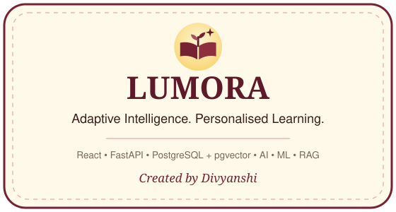

<sub>Lumora supports learning preferences and accessibility needs. It is not a medical device and does not diagnose or treat any condition.</sub>

</div>
