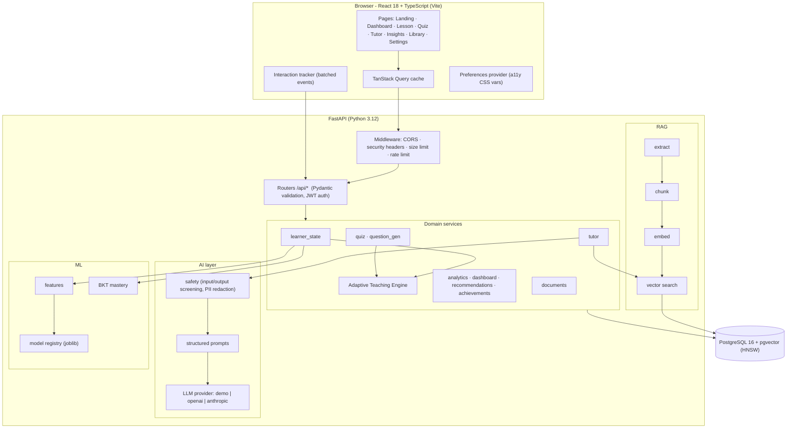
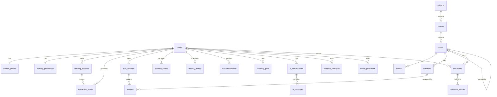

# Lumora — Architecture

## System overview



## Request lifecycle: "Ask Divi"

```mermaid
sequenceDiagram
  participant C as Child (React)
  participant T as tutor service
  participant S as safety
  participant L as learner_state + engine
  participant V as pgvector
  participant P as LLM provider
  C->>T: POST /api/tutor/chat {message, topic_id?}
  T->>S: screen_input (self-harm, unsafe, diagnosis, PII)
  alt unsafe / wellbeing concern
    S-->>C: kind redirect or "talk to a trusted adult"
  else allowed
    T->>T: classify intent (explain / easier / hint / quiz / confused / different)
    T->>V: hybrid retrieval (cosine via HNSW + lexical rerank + topic boost)
    T->>L: build signals -> ML predictions -> TeachingStrategy
    T->>P: structured prompt (strategy + numbered context) -> JSON schema
    P-->>T: TutorReply (validated with Pydantic; demo fallback on error)
    T->>S: screen_output
    T-->>C: answer + steps + examples + cited sources + strategy chips
  end
```

## Adaptive Teaching Engine (`app/adaptive/engine.py`)

A **pure function**: `decide_strategy(LearnerSignals, LearnerPreferenceInput) -> TeachingStrategy`. It has no DB, framework or
I/O dependencies, so it can be unit-tested in isolation and is reused by the public landing-page demos.

1. **Support need per signal family** (each value in 0–1):
   * performance: `1 − (0.65·recent + 0.35·historical accuracy)`
   * mastery: `1 − P(known)`
   * ml_struggle: P(next answer incorrect)
   * behaviour: weighted hints, mistake streak, skips, slowness, low confidence, answer changes, re-explanations
   * momentum: `0.5 − 10·trend_slope`, clipped
2. **Weighted combination**: performance 0.30, mastery 0.25, ml_struggle 0.20, behaviour 0.15, momentum 0.10. Missing families are dropped and the remaining weights re-normalized.
3. **Cold-start shrinkage**: `support = c·raw + (1 − c)·0.58`, where `c = min(1, attempts / 12)`.
4. **Feedback bias**: "too hard" in tutor feedback raises support by up to 0.12.
5. **Policy**: the support score maps to a band (high_support ≥ 0.68 · guided ≥ 0.52 · balanced ≥ 0.36 · stretch). The band, plus preferences
   and the ML engagement prediction, determine difficulty, explanation style, content density, hint level, example count,
   pacing, visual support, number of answer options, quiz length, break suggestion, read-aloud suggestion and tone.
6. **Explainability**: every decision returns `factors` (need × weight) and a human-readable `rationale`. Each one is
   persisted to `adaptive_strategies`, together with the input signals.

## Data model



* `document_chunks.embedding` is `vector(384)` with an **HNSW index** (`vector_cosine_ops`), created by the Alembic migration on PostgreSQL.
* The ORM type `EmbeddingVector` falls back to JSON on SQLite, and search falls back to an exact numpy cosine scan. That keeps unit tests fast without changing behaviour.
* Foreign keys use `ON DELETE CASCADE` for user-owned data, so `DELETE /api/me` erases everything. Check constraints guard
  question difficulty and answer indices. Composite indexes back the hot queries (`(user_id, created_at)` on events, strategies and history).

## Frontend structure

* `lib/`: API client (friendly errors), auth context (JWT), preferences context (applies accessibility CSS variables and classes on `<html>`), interaction tracker, types.
* `components/`: brand (Logo, Divi), illustrations (subject art, journey path, medals, decor), UI kit (progress ring, skeletons, empty and error states, celebration, toggle, read-aloud).
* `pages/`: landing story sections (including the two live engine demos) and the authenticated app. App routes are lazy-loaded, so Recharts only ships with Dashboard and Insights.
